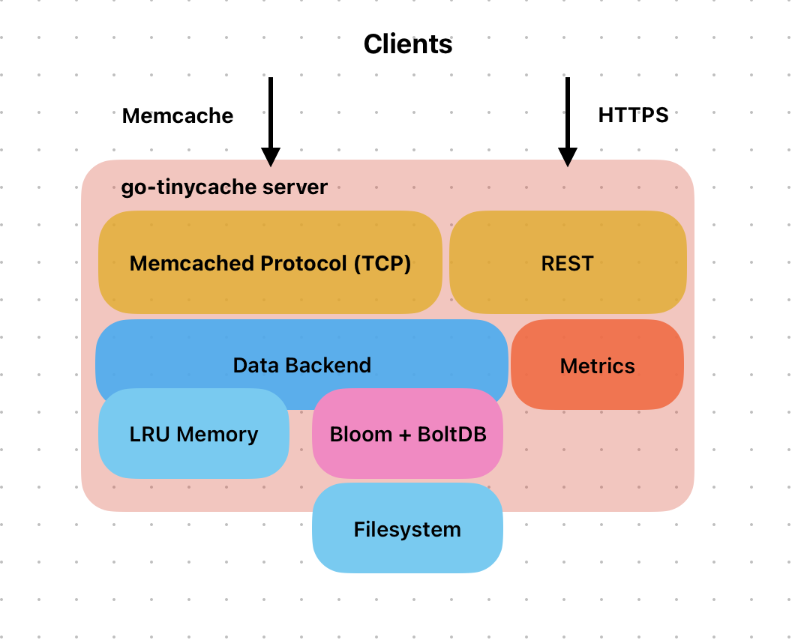

# go-tinycache

go-tinycache is inspired by [beano](https://github.com/gleicon/beano) but modernized and simplified. Its goal is to supplement and demonstrate techniques shown in my book, [go for gophers](https://goforgophers.com)

## A key value database that

* speaks memcached ascii protocol
* persists to bbolt (a fork of BOltDB) or stored data in memory
* cache keys using bloomfilter to avoid unnecessary I/O
* can switch databases on the fly so we can ship "hot" cached by any distribution mechanisms and even use it as a "serverless" databases
* can be set to be readonly
* metrics ridden (expvar, go-metrics and prometheus)
* range queries by key prefix

## Building and Running

To build and run the project, use the provided Makefile targets:

```
make            # Installs dependencies and builds the server binary
make server     # Builds the server binary only
make test       # Runs all Go unit tests
make protocol_test  # Runs the standalone memcached protocol/integration test
make tools      # Builds the standalone memcached client tool in tools/
make clean      # Removes built binaries and test artifacts
```

* The main server binary will be built as `go-tinycache`.
* The protocol/integration test uses a simple Go client to test memcached commands in parallel.
* The `tools` target builds the client tool as `tools/memcached_client`.

## Memcached commands implemented

### From the original Memcached protocol

* ascii quit                              [pass]
* ascii version                           [pass]
* ascii set                               [pass]
* ascii set noreply                       [pass]
* ascii get                               [pass]
* ascii gets                              [pass]
* ascii add                               [pass]
* ascii replace                           [pass]
* ascii delete                            [pass]

### Implemented but not in Memcached specs, available as REST routes too
  
* statdb - database stats
* switchdb <dbname> - switch gracefully to new db file
* range <prefix> [limit] - range query of keys that begin w/ prefix, limited by [limit]. no limit or -1 means bring it all.

## REST API

* /api/v1/switchdb: changes database on the fly
  * example: curl -d "filename=/tmp/memcached2.db" http://127.0.0.1:8080/api/v1/switchdb

* /debug/vars
  * expvar json from Go

## Architecture



## Licensing: MIT


