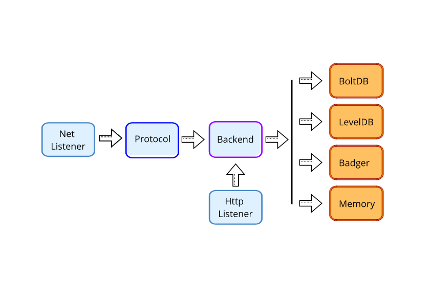

# go-tinycache

go-tinycache is inspired by [beano](https://github.com/gleicon/beano) but modernized and simplified. Its goal is to supplement and demonstrate techniques shown in my book, [go for gophers](https://goforgophers.com)

## A key value database that 

  - speaks memcached ascii protocol
  - persists to bbolt (a fork of BOltDB) or stored data in memory
  - cache keys using bloomfilter to avoid unnecessary I/O
  - can switch databases on the fly so we can ship "hot" cached by any distribution mechanisms and even use it as a "serverless" databases
  - can be set to be readonly
  - metrics ridden (expvar, go-metrics and prometheus)
  - range queries by key prefix

## Buildind and Running
	$ go-tinycache [-s ip] [-p port] [-f /path/to/db/file -q -b boltdb|inmem]")
		- default ip: 127.0.0.1
		- default port: 11211
		- default backend: leveldb
		- default db path+file: ./memcached.db
		- (-q enables profiling to /tmp/*.prof")

## Memcached commands implemented
  - any regular memcached client will do
    - ascii quit                              [pass]
    - ascii version                           [pass]
    - ascii set                               [pass]
    - ascii set noreply                       [pass]
    - ascii get                               [pass]
    - ascii mget                              [pass]
    - ascii add                               [pass]
    - ascii replace                           [pass]
    - ascii delete                            [pass]

  - not in memcached specs: 
    - statdb - stats
    - switchdb <dbname> - switch gracefully to new db file
    - range <prefix> [limit] - range query of keys that begin w/ prefix, limited by [limit]. no limit or -1 means bring it all.

- modified behaviour wrt memcached
    - gets - alias to range so all drivers can work.

## REST API
  - /api/v1/switchdb
    - changes database on the fly
    - example: curl -d "filename=/tmp/memcached2.db" http://127.0.0.1:8080/api/v1/switchdb

  - /debug/vars
    - expvar json

## Architecture

Network servers, command parsing and backend db implementations are split to make it easy to add new backends. That was inspired by memcached and made working on Beano easy.

The HTTP listener provides expvars and a basic api to switch datastores

Separated db modules means that I could implement caching in front of Boltdb that were natively present on LevelDB without leaking through the backend interface abstraction.

## TODO
   - It already pass the basics of memcapable -a for set/get/replace. Incr and Decr are wip. 
   - Better log configure (for now stats are dumped each 60 secs to log handler, not properly formatted)

## Why beano ?

Naming things is hard, so I've named this project after a blues breaker album that was named after a comic.

## Licensing: MIT

